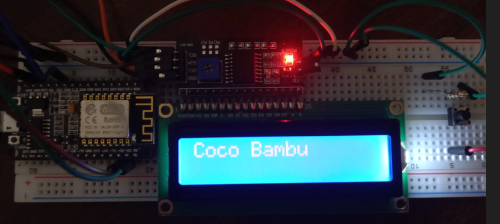
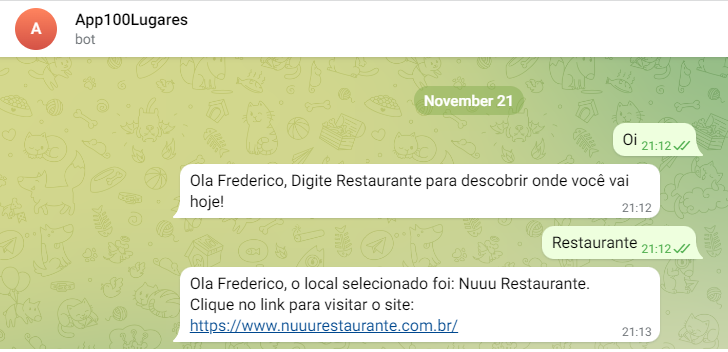

# Sorteador-Esp8266

Este projeto implementa os dois tópicos abaixo:

**1** - Sortear restaurantes: Ao pressionar um push button no circuito montado com o microcontrolador esp8266 uma requisição HTTP com o método GET será realizada ao servidor e o retorno será apresentado em um LCD de 16x2.

**2** - Integrar com um bot do telegram, ao acessar o App do telegram pelo celular ou computador e procurar pelo BOT App100Lugares, envie uma mensagem qualquer e as instruções serão enviadas pelo Esp. Após digitar a palavra chave "Restaurante", o microcontrolador fará a requisição GET e irá responder com o resultado.

## Pré-requisitos para testar a aplicação

O servidor deve estar rodando localmente.

O link abaixo direciona para o respositório onde o projeto se encontra: [Servidor](https://github.com/FredericoFirmo/Restaurantes-API).

## Testes

**Circuito eletrônico**

**Telegram BOT**

